# НЕТ ПОВЕСТИ ПЕЧАЛЬНЕЕ НА СВЕТЕ,
# ЧЕМ ПОВЕСТЬ О ТЁМЕ, ОБСИРВОБЕТИ И МОНИТОРЕТЕ


# ЧАСТЬ 0

    Решил использовать minikube.
    Скачал minikube и kubectl.

    Написал код. Написал Докер файл, собрал образ и загрузил образ в кубик

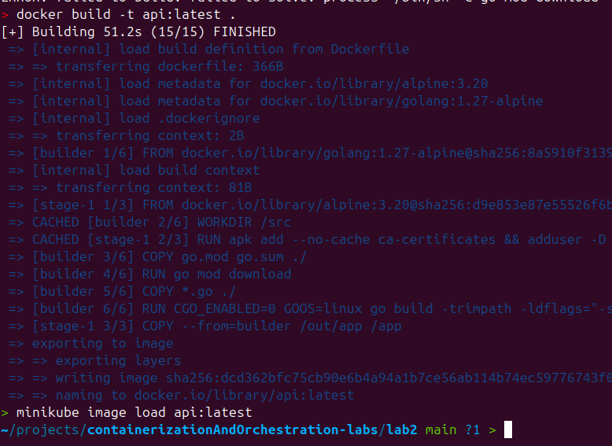

    Далее нужно было написать манифест Deployment и Service
    Загрузить манифест в кубик.

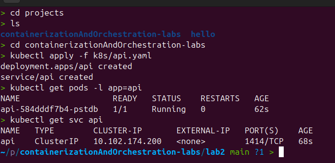

```yaml
kind: Deployment
spec:
  replicas: 1
  selector:
    spec:
      containers:
        - name: api
          image: api:latest
          imagePullPolicy: Never
          ports:
            - name: http
              containerPort: 1414
          env:
            - name: OTEL_EXPORTER_OTLP_ENDPOINT
              value: "jaeger.monitoring:4317"
            - name: OTEL_SERVICE_NAME
              value: "api"
            - name: SELF_URL
              value: "http://localhost:1414"
---
apiVersion: v1
kind: Service
spec:
  selector:
    app: api
  ports:
    - name: http
      port: 1414
      targetPort: 1414
```

Что для чего нужно:
 - Deployment - запускает контейнер с приложением из указыванного образа
 - Service - настраивает порты для сети внутри кластера

Далее нам нужен скачать HELM
Тут скриншота не будет потому "HAPPY HELMING"

    А что такое HELM?
    helm - менеджер пакетов для кубика, тут я могу сравнить только с maven для java и spring 

Остался только одна проблемка если перейти на localhost:1414 то.... 
Ничего не получится потому что порты прокинуты только внутри кластера
Я настраивал порты идентично тем что есть внутри с помощью `kubectl port-forward svc/api 1414:1414 &`
Для все сервисов далее так же пришлось прокидывать port-forward (((

# ЧАСТЬ 1 Метрики (Prometheus + Grafana)

СПАСИБО ЧТО ЕСТЬ HELM!!!
Всё устанавливаю через него. 


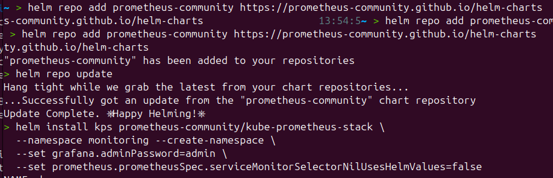

    Запускаем и проверяем запустились ли они

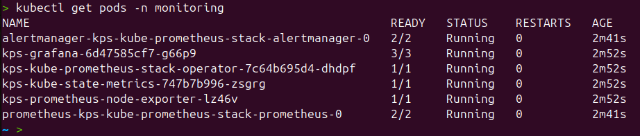

    После чего надо прописать манифест servicemonitor
    Нужен он для того чтобы показать Prometheus для того что он искал сервис api и с портом 1414 и обращался на ручку /metrics

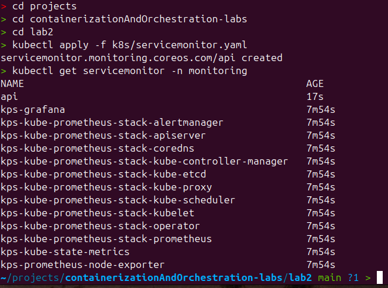

    GRAFANA же в свою очереь настраивается сама нужно только прокинуть 
    `kubectl port-forward -n monitoring svc/kps-grafana 3000:80`
    Она берёт данные из Prometheus

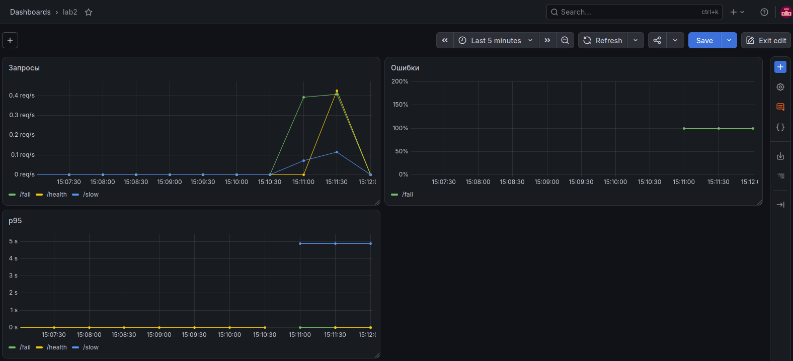

    Вот такая красота получилась 
    А именно вот так:

```promql

sum(rate(http_requests_total[1m])) by (path)

100 * (
    sum(rate(http_requests_total{status=~"5.."}[5m])) by (path)
    /
    sum(rate(http_requests_total[5m])) by (path)
)

histogram_quantile(0.95,sum(rate(http_request_duration_seconds_bucket[5m])) by (le, path))

```


# ЧАСТЬ 2 ЛОГ(К)И


    Матрики метриками растут падают, но как нам понимать что именно произошло и почему что то идёт не так
    Логи как раз и нужны нам чтобы это ПОНИМТЬ 

Установка:

```bash
helm repo add grafana https://grafana.github.io/helm-charts
helm repo update

helm install loki grafana/loki-stack \
--namespace monitoring \
--set promtail.enabled=true \
--set loki.persistence.enabled=false \
--set grafana.enabled=false
```

Тут конечно не обошлось без проблем. Grafana не видела loki по которкой ссылке loki:3100.
помогло поменять на `http://loki.monitoring.svc.cluster.local:3100`

ВОТ ТУТ как раз ничего не подключалось:

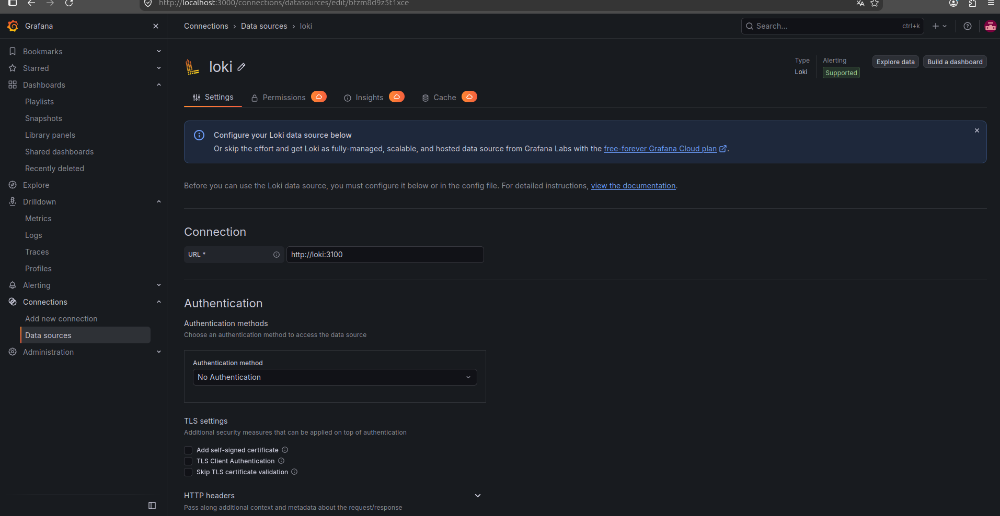

Да не тут то было loki-stack по установки добаляет isDefault: true, что конфликтовало с Prometheus, где isDefailt тоже true. 

Тут ещё были пролемы с тем чтобы логи были не просто строкой, а именно JSON формате чтобы искать было легче. И поменял в main.go на slog (Спасибо golang разработчикам, что сделали всё из под капота)

ИИИ БАМММ ВСЁ ПОЛУЧИЛОСЬ:

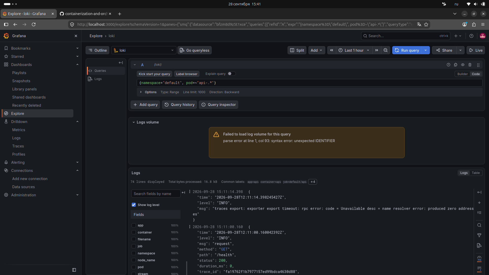


  Вызвал несколько `/fail` и получилось посмотреть логи и найти ошибки в логах:


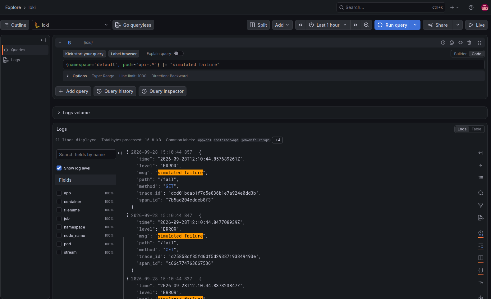


# ЧАСТЬ 3 - Трейсы (Opentelemetry + Jaeger)

Так же установка, тут была проблема с тем что у меня zsh оболочка на терминале и оно не могла [0] запарсить по этому в виде строчки всё.

```bash

helm repo add jaegertracing https://jaegertracing.github.io/helm-charts
helm repo update

helm install jaeger jaegertracing/jaeger \
  --namespace monitoring \
  --set provisionDataStore.cassandra=false \
  --set allInOne.enabled=true \
  --set storage.type=memory \
  --set agent.enabled=false \
  --set collector.enabled=false \
  --set query.enabled=false \
  --set 'allInOne.extraEnv[0].name=COLLECTOR_OTLP_ENABLED' \
  --set 'allInOne.extraEnv[0].value=true'

```

  Тут я впервые столкнулся с предательством в виду своей наивности. В тз было сказано что проще всего черещ jaeger-all-in-one, но это было не проще

У меня Jaeger не видел мой api 

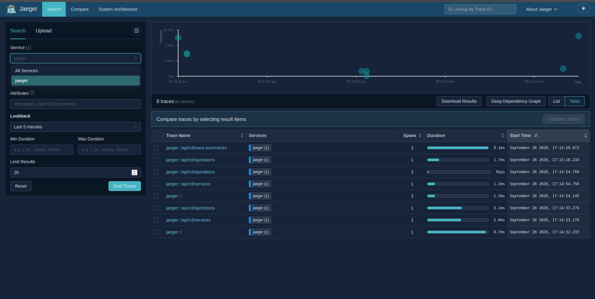

  Пофиксил это тем, что в манифесте переписал c jaeger-all-in-one на jaeger. И БУУУМ:

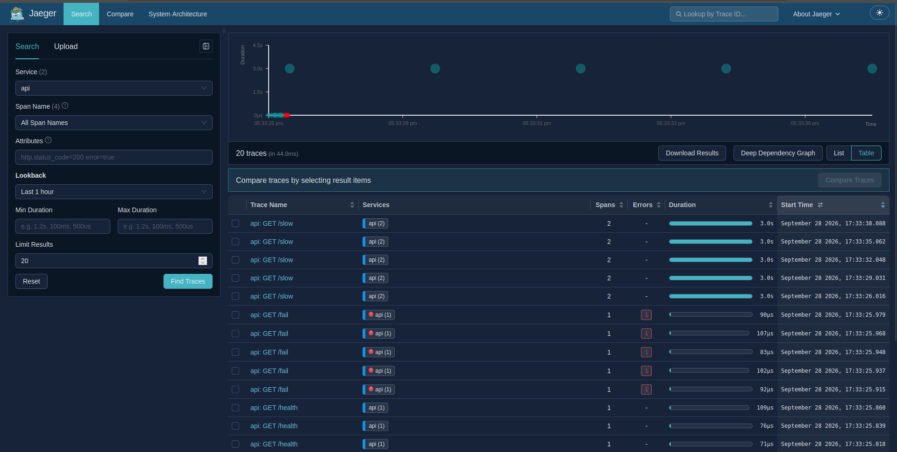

Прокинул `/slow` и посмотрел этот одноэтажный водопадик хапхапхахп: 

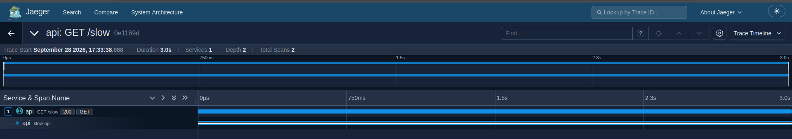


  Далее нужно было сделать `/fail` найти её в логах скопировать id. Найти id в трейсах и отследить почему, в каком сервисе (если бы их было много хехех) произошла ошибка и потом её пофиксить.


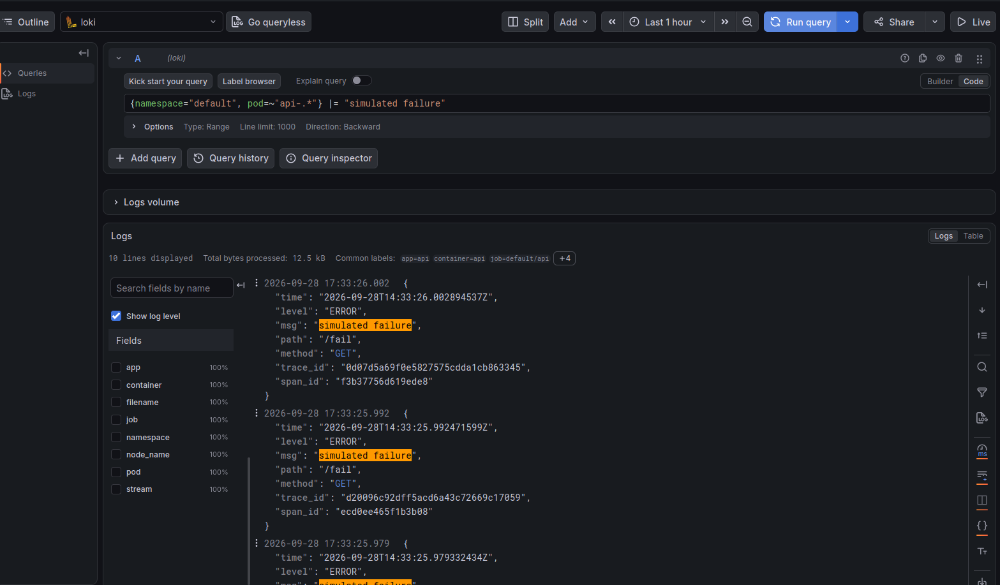


  всял первый попавшийся `0d07d5...` что то там.


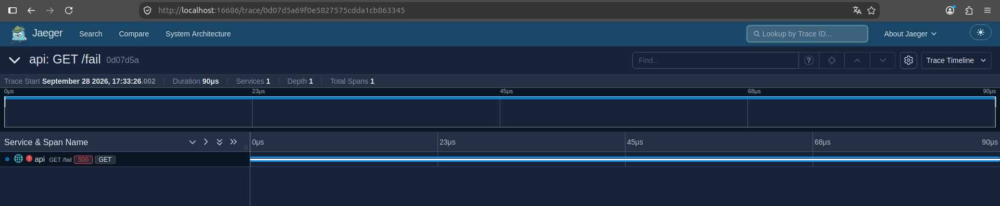


# ЧАСТЬ 4 (Alertmanager + Telegram + Karma)

  Сначала было придумать на что повесить алерты и что отлавливать. Взял самые очевидные тут ничего интересно не стал придумывать, разве что комментарии)

  - HighErrorRate	severity: critical 
    - много ошибок возникает в пределе одной минуты. помести в critical,тк мне кажется это что то важное сильно
  - HighLatency	severity: warning
    - сервис работает медленно, это точно не критично, но с этим делать что то надо
  - ServiceDown	 severity: critical
    - Сервис упал, это вообще ... пипец)

  Записал в alert.yaml

```bash

apiVersion: monitoring.coreos.com/v1
kind: PrometheusRule
metadata:
  name: api-alerts
  namespace: monitoring
  labels:
    release: kps
spec:
  groups:
    - name: api.rules
      interval: 30s
      rules:
        - alert: HighErrorRate
          expr: |
            (
              sum(rate(http_requests_total{status=~"5.."}[5m]))
              /
              sum(rate(http_requests_total[5m]))
            ) > 0.05
          for: 1m
          labels:
            severity: critical
          annotations:
            summary: "Error rate > 5% за 1 минуты"
            description: "АХТУНГ!!!! СЕРВЕР ПЯТИСОТИТ. Текущий error rate: {{ $value | humanizePercentage }}"

        - alert: HighLatency
          expr: |
            histogram_quantile(0.95,
              sum(rate(http_request_duration_seconds_bucket[5m])) by (le)
            ) > 1
          for: 1m
          labels:
            severity: warning
          annotations:
            summary: "p95 latency > 1s за 1 минуты"
            description: "ТЕРЯЕМ ДЕНЬГИ, КЛИЕНТЫ УХОДЯТ!!!! Долго грузит p95: {{ $value }}s"

        - alert: ServiceDown
          expr: up{job="api"} == 0
          for: 1m
          labels:
            severity: critical
          annotations:
            summary: "ВСЁ УПАЛО!!!"
            description: "ВСЁ УПАЛО!!!"

```

  Так же нужно было настроить Alertманагера, потому что по дефолту он никуда ничего не отправляет, были варианты с почти и прочими сервисами, но мне вот сильно хотелось реализовать alert в telegram.

  + это делается быстро удобно и без каких либо проблем. 

```yaml

apiVersion: v1
kind: Secret
metadata:
  name: alertmanager-kps-kube-prometheus-stack-alertmanager
  namespace: monitoring
type: Opaque
stringData:
  alertmanager.yaml: |
    global:
      resolve_timeout: 5m

    route:
      receiver: telegram
      group_by: ['alertname']
      group_wait: 10s
      group_interval: 1m
      repeat_interval: 4h

    receivers:
      - name: telegram
        telegram_configs:
          - bot_token: 'бе бе бе НИЧЕГО Я ВАМ НЕ ПОКАЖУ'
            chat_id: И ID ЧАТА ТОЖЕ не узнаете))
            parse_mode: 'HTML'
            send_resolved: true

```

  Теперь нужно было провеить всё ли работает и вызвать ошибки:

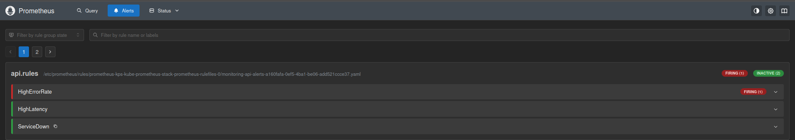
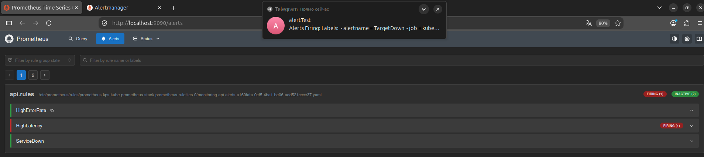
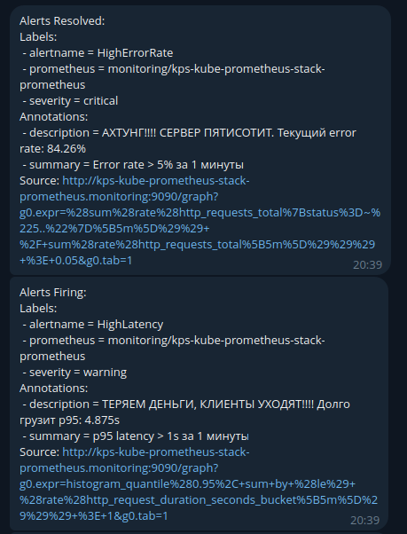
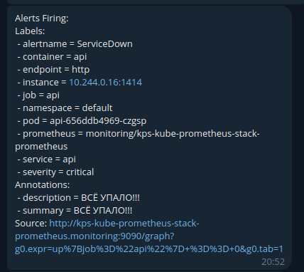


## Karma

  Надо было её установить и запустить, но у меня не получалось тк wiremind/karma не подтянул ConfigMap

  пришлось написать самому

```yaml

apiVersion: v1
kind: ConfigMap
metadata:
  name: karma-config
  namespace: monitoring
data:
  karma.yaml: |
    alertmanager:
      servers:
        - name: alertmanager
          uri: http://kps-kube-prometheus-stack-alertmanager:9093

```

  Благо всё заработало почти сразу и проблем не возникло.


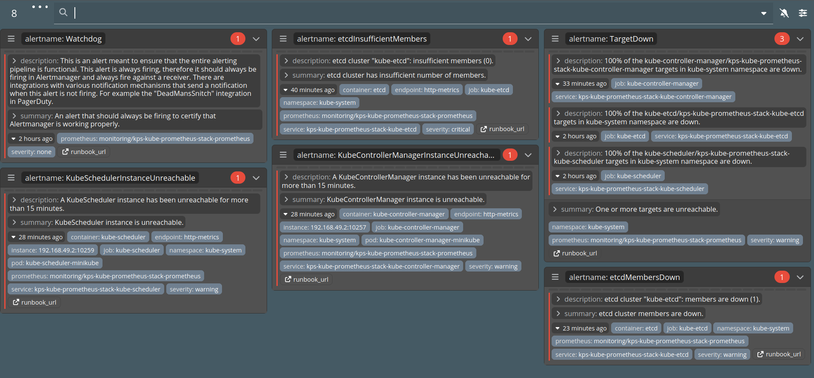

  Что ещё хотел отметить, какая же Karma приятная в пользовании и с точки зрения,н и визуально приятная. Настроил только чтобы обновления было не раз в 30 секунд а раз в 10 сек.


